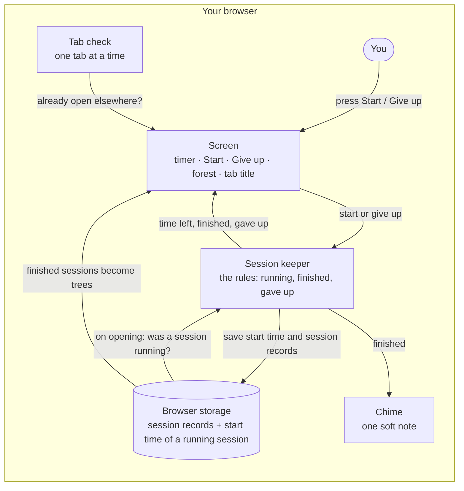

# Forest Timer spec

Date: 2026-10-01
Written from: the grilling on 2026-10-01 (notes in `2026-10-01-notes.md`), plus `idea.md`, `DESIGN.md` and `docs/stack.md`.

## What it is

A focus timer that grows a tree in your forest every time you finish a session. It's for me, and people like me who lose focus and like seeing progress. I start a focus session and then quit halfway through, and nothing shows me if my focus is adding up to anything.

It runs entirely in the browser, on a laptop or a phone: no accounts, no shared data and no secret keys.

## Screens

There's one screen. The timer sits on top, and the forest sits below it, under a single thin line. The screen has two states.

**Ready** (no session running)
- The timer reads 25:00.
- The **Start** button sits under it.
- There's no Give up link, because there's nothing to give up yet.

**Running** (a session is counting down)
- The timer counts down in minutes and seconds: 24:59, 24:58 … 0:59 … 0:01, 0:00. It never shows hours.
- Start disappears.
- Only the quiet **Give up** link sits under the timer.
- Clicking Give up asks once, in place, without a pop-up box. The link becomes "Give up? No tree this time." with **Keep going** (the moss-green button) and **Give up** (the quiet link).

**The forest** (below the line, in both states)
- Every tree you've ever grown, all time.
- Trees sit in rows like treelines. When a row is full, the next tree starts a new row underneath. How many fit in a row depends on the screen width: roughly a dozen on a phone, a few dozen on a laptop.
- The newest tree comes first: top-left, right under the line. Older trees move along one spot each time.
- The tree you just grew has the small orange dashed ring, but only for the moment it grows. The ring stays until you press Start again or leave the page, whichever comes first. A tree that finished while you were away (sleep or a late reload) gets the ring when you come back to it.
- On the very first visit, with no trees yet, one short line in the muted grey reads "Finish a session to grow your first tree." It disappears once there's a tree.

**Another tab**
- If Forest Timer is already open in another tab, this tab shows only "Forest Timer is open in another tab." in the muted grey, with no timer and no buttons.

**The browser tab's title**
- While running, it shows the time left, like "12:34 · Forest Timer."
- At all other times, it's just "Forest Timer."

## Look

Follow `DESIGN.md`. It covers the colors, type, layout, components and do's and don'ts, and the mood board behind it is in `docs/references/`. The two things to remember: moss green only for things you can press, and orange only on the tree you just grew.

## Data

Everything is saved in this browser, so it's still there next visit.

For every session, finished or given up, the app saves a **session record** with three things:
- when it started
- when it ended
- how it ended: finished or gave up

For a close or a crash, "ended" is the last moment the page was open, to within a few seconds. Length comes from the start and end times. Date and length matter to me.

While a session runs, the app also saves the moment Start was pressed, so a reload can pick the session back up.

Given-up sessions are saved but not shown anywhere, for now.

## Rules

1. **A session is 25 minutes.** There's no other length, and there's no break timer after it.
   *Example:* press Start at 9:00, and the session finishes at 9:25.

2. **Finishing grows one tree.** When the 25 minutes are up, the tree appears first in the forest with its orange ring, one soft chime plays, and the screen goes back to ready. On a laptop, the chime plays even if you're in another tab. A locked phone freezes the page, so there the chime plays when you come back to the tab, at the same time the tree appears. The exact note gets picked during the build, for me to hear and approve.
   *Example:* finish at 9:25, hear the chime, and the new ringed tree sits top-left while the timer reads 25:00 again. Press Start at 9:30, and the ring is gone.

3. **Giving up grows no tree, but it's recorded.** Clicking Give up asks first. "Keep going" carries on, and "Give up" ends the session.
   *Example:* at 9:12 you click Give up, then Keep going, and the session carries on. Click Give up again, then Give up, and the session ends with no tree and a given-up record.
   *Example:* with 0:02 left you click Give up, and "Give up? No tree this time." appears. You wait, and at 0:00 the session finishes: the question disappears, and you get the tree and the chime.

4. **A reload mid-session carries on.** This means a reload of the tab the session started in. The timer picks up from where it should be, as if you never left.
   *Example:* start at 9:00 and reload at 9:10, and the timer shows 15:00 left.

5. **A reload after the 25 minutes would have ended counts as finished.** You get the tree and the chime. This matches rule 9: the clock runs from Start. It matters most on phones, which often reload a tab on their own after it has sat in the background.
   *Example:* start at 9:00, lock the phone, and open the browser at 9:40. It reloads the tab, and you get the tree and the chime.

6. **Closing the tab or browser mid-session is a give-up.** It's recorded the next time the app opens.
   *Example:* start at 9:00, close the tab at 9:10, and there's no tree.

7. **A browser crash counts as a give-up.** The app can't tell a crash from a close. The exception: if the browser brings the tab back as a reload, the reload rules (4 and 5) apply.
   *Example:* start at 9:00, the browser crashes at 9:20, and when you open the app again there's no tree.

8. **One tab at a time.** A second tab shows only "Forest Timer is open in another tab." Opening or closing it never gives up the session in the first tab.
   *Example:* start in one tab at 9:00 and open a second tab at 9:05, and the second tab shows the line while the first keeps counting. Close the second tab and nothing changes.
   *Example:* the session is running in the first tab and the second tab shows the line. You close the first tab at 9:10: that's a give-up (rule 6). The second tab keeps showing the line until you reload it. Then it opens normally on ready, with no tree for that session.

9. **If the laptop sleeps, the clock keeps running.** The timer always counts from when you pressed Start. If it finishes while the laptop is asleep, you get the tree.
   *Example:* start at 9:00, close the lid at 9:10 and open it at 9:15, and 10:00 is left. Open it at 9:40 instead, and the session has finished: you get the tree and the chime.

10. **No reset.** You can't clear the forest from inside the app. Clearing the browser's site data is the only way to start fresh.
    *Example:* after a month of trees, there's no button anywhere that wipes them.

## Built with

Follow `docs/stack.md`: React, Tailwind and shadcn (with Lucide icons), JavaScript running in the browser, the browser's storage, and Vite. History lives in git, backed up on GitHub, and it's hosted on Cloudflare.

## Architecture

Everything happens in one place: your browser. Hosting only hands the browser the app, and after that there's no server. The **screen** shows the timer, the buttons and the forest, and it's the only thing you touch. The **session keeper** owns the rules: it knows whether a session is running, counts time from when Start was pressed, and decides "finished" or "gave up," including after a reload, a close, a crash or sleep. When it decides, it writes a session record to **browser storage** and tells the screen, and when the session finishes it also plays the **chime**. The screen then rebuilds the forest from the finished records. A **tab check** makes sure only one tab runs the app at a time.

## First build

Everything above:

- the ready and running states
- the 25-minute countdown, with the time left in the tab title
- finishing: a tree, the orange ring, the chime, then back to ready
- Give up, asking first
- the reload, close, crash and sleep rules
- one tab at a time
- session records saved in the browser
- the forest: all time, in rows, newest first, with the first-visit line

There's **no pause** in the first build.

**Open: pausing.** Undecided. Building without a pause for now is fine.

## Possible future scope

- A stats page, where given-up sessions, dates and lengths would show.
- A pause (see Open, above).
- A reset.
- A streak.
- Picking my own session length instead of 25 minutes.
- Different kinds of trees.
- Friends seeing each other's forests. This needs accounts, a back end and a database, so it's for later.
