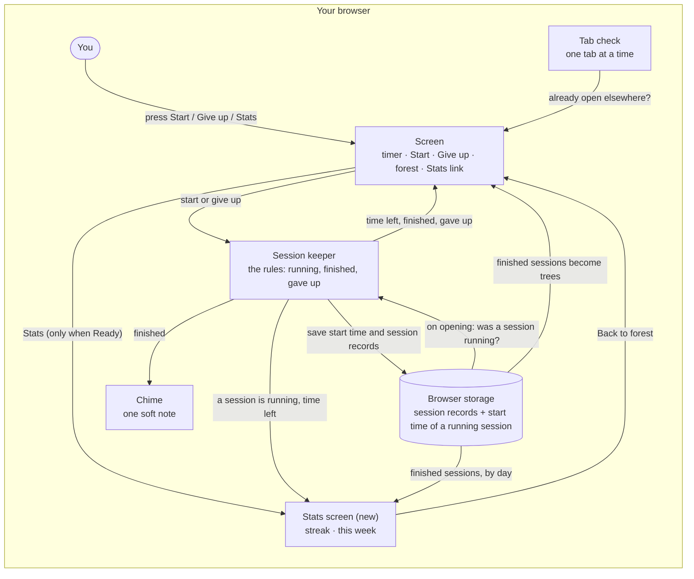

# Forest Timer spec: stats page

Date: 2026-10-02
Written from: the grilling on 2026-10-02 (notes in `2026-10-02-notes.md`), plus `CONTEXT.md`, `DESIGN.md` and `docs/stack.md`.
The first spec, `2026-10-01-spec.md`, still holds for everything else in the app.

## What it is

A page that shows how my focus is adding up: my streak, and this week's finished sessions. It only reads the session records the app already saves. Nothing new is saved.

## Screens

**Ready, on the main screen**
- A quiet **Stats** link sits at the top-right corner, in the same muted, underlined style as "Give up."
- It only shows when Ready. While Running it's hidden, so it can't pull you away mid-session.
- It opens the stats page at its own address, `/stats`, so it can be bookmarked or opened straight on a phone.

**The stats page**
- **The streak**, big, at the timer's size, as the page's one big thing: "3-day streak," or "1-day streak" for one.
- At zero, it reads instead: "No streak yet. Finish a session to start one." in body text and ink, like the first-visit line, so a zero never looks like a scolding.
- **This week**, under the streak:
  - the total: "9 sessions this week"
  - seven short day names, Mon to Sun, each with its count of finished sessions under it as a plain number, in muted ink
  - today marked in the main text color
  - days with nothing show "0"; days still to come this week are blank
- With no sessions at all, the week shows "0 sessions this week" with zeros up to today.
- A quiet **Back to forest** link takes you back to the main screen.

```
          3-day streak

      9 sessions this week
  Mon  Tue  Wed  Thu  Fri  Sat  Sun
   4    3    2    0
```

**Opening /stats mid-session** (by typing the address)
- That's a page load, so the reload rule applies and the session carries on.
- The stats page shows "A session is running, 12:34 left" with a link back to the timer.

## Look

Follow `DESIGN.md`. Muted ink is already its color for counts and dates. Since 2026-10-02, `DESIGN.md` and `CONTEXT.md` win over a spec on how things look and where they sit.

## Data

Nothing new is saved. The stats page reads the session records already saved in this browser (when each session started, when it ended, and how it ended) and works everything out from them.

## Rules

1. **This week is Monday to Sunday, in your own time zone.**
   *Example:* on Wednesday, Monday to Wednesday are filled in and Thursday to Sunday are still blank. On Monday the week starts fresh at zero.

2. **A session counts on the day it finished.** That's when the tree grew.
   *Example:* start at 11:50pm Tuesday and finish at 12:15am Wednesday, and it counts on Wednesday. Start at 11:50pm Sunday and finish at 12:15am Monday, and it counts toward the new week.

3. **The streak is how many days in a row, up to today, you finished at least one session.**
   *Example:* I finish sessions Monday, Tuesday and Wednesday. On Wednesday my streak is 3.

4. **Today doesn't break the streak until it's over.** No scolding at breakfast.
   *Example:* finished Monday, Tuesday and Wednesday. Thursday at 9am, with nothing yet, it still says 3. Finish one Thursday and it says 4. Skip Thursday, and on Friday it says 0 until I finish one.

5. **Given-up sessions don't count and don't show.** They aren't in the week's numbers or the streak, and they stay saved.
   *Example:* Monday I finish 2 sessions and give up 1. Monday shows 2.

6. **The Stats link only shows when Ready.**
   *Example:* press Start, and the Stats link disappears. When the session finishes or you give up, it's back.

7. **Opening /stats mid-session carries the session on.** If it finishes while you're on the stats page, it still counts: tree, chime, and this week's numbers.
   *Example:* start at 9:00 and type the /stats address at 9:10. The page says "A session is running, 15:00 left." At 9:25 the session finishes, the chime plays, and today's count goes up by one.

## Built with

Follow `docs/stack.md`: React, Tailwind and shadcn, JavaScript in the browser, the browser's storage, and Vite, hosted on Cloudflare.

## Architecture

Everything still happens in your browser. There's one new box: the **Stats screen**. It reads the finished session records from **browser storage**, counts this week's finished sessions by the day each finished, and works out the streak. It saves nothing. The **screen** gets a quiet Stats link while Ready, and the Stats screen links back. If a session is running, the **session keeper** keeps it going on the Stats screen too, and tells it the time left.



## First build

Everything above:

- the quiet Stats link on Ready, hidden while Running
- the stats page at /stats, with Back to forest
- this week: the total and each day's count, Monday to Sunday, by the day each session finished
- the streak, including "No streak yet" at zero, and today not breaking it
- opening /stats mid-session: the session carries on, with its time left shown

## Assumed, and okayed (2026-10-02)

- "Back to forest" sits at the top-left, mirroring Stats at the top-right.
- One session reads "1 session this week."
- The mid-session link back reads "Back to timer."
- The one-tab rule still holds on /stats: a second tab there shows "Forest Timer is open in another tab."
- If midnight passes with the stats page open, the counts move to the new day without a reload (and Monday starts a fresh week).
- The browser tab's title on /stats works as now: "Forest Timer," or the time left while a session runs.
- Opening /stats straight on the hosted app works.
- Today's marker in the main text color covers both the day name and its count.

## Possible future scope

- Given-up sessions on the stats page.
- A pause.
- A reset.
- Picking my own session length instead of 25 minutes.
- Different kinds of trees.
- Friends seeing each other's forests. This needs accounts, a back end and a database, so it's for later.
